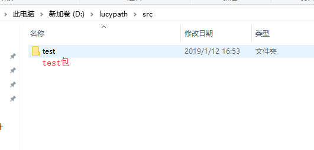

### 前面的章节中，已经安装好了lucy
学语言第一件事就是hello world

lucy语言都是以包单位运行的，在src目录中编写用户代码。
比如在src有个test目录，这个其实就是lucy语言的一个包，只要里面包含.lucy文件就是可以运行的。

 

运行test包如下
~~~
    java  -jar d://lucy/lucy.jar run test
~~~

lucy工具链会根据包名和LUCYPATH去搜索代码所在目录，编译并运行。
编译后的class文件存放在class目录中，路径和源代码路径相对应。

*包名不能重定义，其实就是路径名。*

