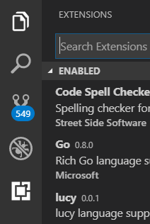
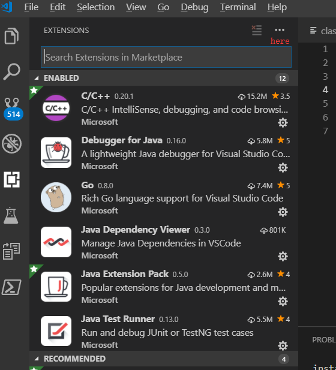
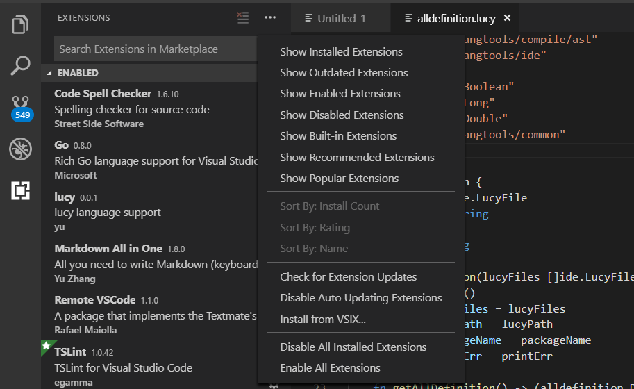
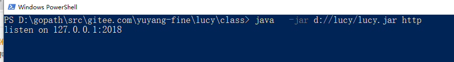

### vscode插件
vscode已经支持了lucy语言，包括代码高亮，跳转，查找引用和自动完成。
官网：https://code.visualstudio.com/

 

## 安装vscode插件
1 选择extensions菜单。

2 点击more actions(...)。

3 选择install  from VSIX,选择lucy安装目录的lucy.vsix文件安装即可。
4 重新加载后即可使用。
5 vscode插件依赖lucy的语言服务器。
 

## 运行语言服务器
这个程序运行在127.0.0.1:2018端口，目前插件的端口已经写死，请保证此端口可用。
~~~
java d://lucy/lucy.jar http
~~~
