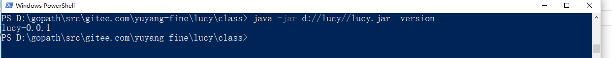

### jdk
lucy是一门jvm语言，所以需要首先安装java虚拟机，下面贴出官方jdk的下载链接。
lucy需要jdk8及以上版本
**[jdk下载地址](http://www.oracle.com/technetwork/java/javase/downloads/index.html)**

请自行按照官方文档安装。

 

下载好官方语言包之后我们假设，你把官方语言包解压到windows的d盘，其他平台的朋友请根据文档自行调整。

 

### 环境变量
LUCYROOT是系统库和lucy工具链的根目录。
请把LUCYROOT设置为 D:\lucy

 

LUCYPATH是用户代码的路径。
请把LUCYPATH设置为 D:\lucypath
当然LUCYPATH是用户自由配置的。

 

CLASSPATH是java虚拟机使用的环境变量。
请把D:\lucy\class , D:\lucy\lib , D:\lucypath\class加入CLASSPATH变量中。

 

### 测试是否安装成功

运行
~~~
java -jar d://lucy//lucy.jar  version
~~~

